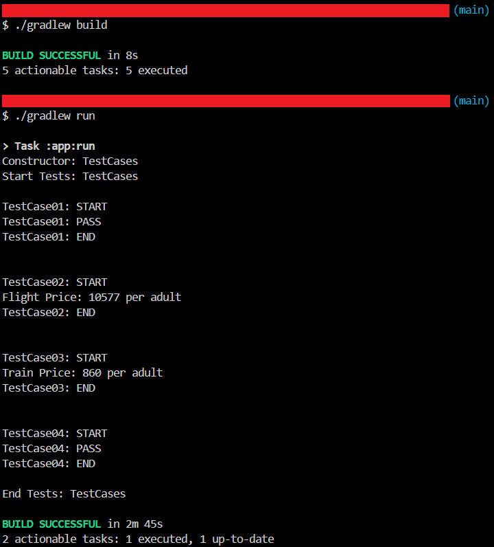

# Make My Trip Automation

`Selenium` `Dynamic Xpaths`

---

During the course of this project automated Make My Trip website to get flight, bus and train details from 2 destinations and validating the search functionality of the website.

---

# Overview
During the course of this project automated Make My Trip website to get flight, bus and train details from 2 destinations and validating the search functionality of the website.

# Automating Make My Trip
## Scope of work
* Automated the following test cases:
    * Verify Make My Trip Homepage URL
    * Get Flight Details from Bangalore to New Delhi
    * Get Train Details from Bangalore to New Delhi
    * Verify that there are no buses from Bangalore to Kathmandu

## Skills used
`Selenium` `Dynamic Xpaths`

---

# Screenshots

